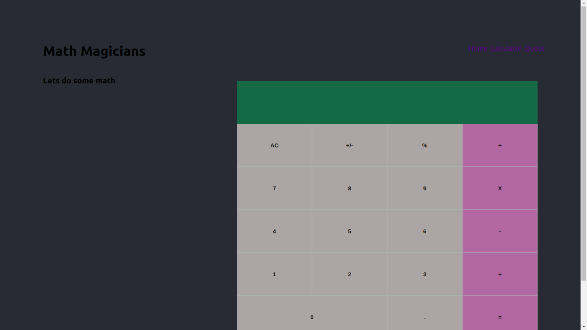

 

  

  <h2 align="center">Project: Calculator-App </h2>

  

    This project is part of the Microverse curriculum in React and Redux module!

## About the Project

This project is a calculator for Math-magicians Inc using create-react-app, a tool built by developers at Facebook to help build React applications, saving you from time-consuming setup and configuration.

## Built With
This project was bootstrapped with [Create React App](https://github.com/facebook/create-react-app).

- CSS
- Javascript
- Jess
- React-Bootstrap
- React

## Live version
The live version of this project can be found [here](https://immense-refuge-69310.herokuapp.com/)

## Getting Started 
Clone this repository into your PC and then navigate into the directory where you cloned it into.
Run any of the available scripts outlined below.

## Available Scripts

In the project directory, you can run:

### `npm run start`

Runs the app in the development mode.\
Open [http://localhost:3000](http://localhost:3000) to view it in the browser.

The page will reload if you make edits.\
You will also see any lint errors in the console.

### `npm run test`

Launches the test runner in the interactive watch mode.

### `npm run build`

Builds the app for production to the `build` folder.\
It correctly bundles React in production mode and optimizes the build for the best performance.

The build is minified and the filenames include the hashes.\
Your app is ready to be deployed!

👤 **Author**

***Joseph Mindo***
- Github: [@MindoJoseph](https://github.com/Mindo-Joseph)
- Twitter: [@mindoJoseph](https://twitter.com/mindoJoseph)
- Linkedin: [Joseph Mindo](https://www.linkedin.com/in/josephmindo/)

## Show your support

Give a ⭐️ if you like this project!

## 📝 License

This project is [MIT](https://github.com/Mindo-Joseph/CalculatorProject/LICENSE) licensed.